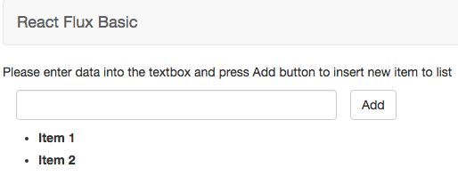

# Basic application with React & Flux
> Sample structure of Flux framework integrate with React



## Introduction

Flux is application architecture with Unidirectional model. It has three main components: Dispatcher, Store and View.

## Overview

* Dispatcher (AppDispatcher.js): the central hub that manages all data flow.

* Store (AppStore.js):  
    * Register a callback function with Dispatcher to receive data from Action. The Action is created when users interact with application such as press button,...
    * When receive the action, create a new item and emit change to Controller-View to update approriate View.

* Controller-View & View:
    * Controller-View (App.jsx): is top of the nested view hierarchy. It's in charge of listening for events and retrieving data from the Store in an event handler. When it receives onChange command, re-render themselves and all of their descendants in the component tree.  
    * View (Main.jsx): render data and where users interact with application.

## Flow Description

* User enters data and presses Add button to insert a new item -> create an Action with "ADD_ACTION" actionType and send it to Dispatcher.

* Store receives "ADD_ACTION". Then create a new item and emit changes to Controller-View. Controller-View receives data and re-render child Views, which has a new item in list.

## Installation

### Development Environment: Run in webpack-dev-server  
1.Install all node modules (build into node_modules folder)  

```
npm install
```

2.Start webpack-dev-server. You can change config of server (IP, port) in package.json.  

```
npm start
```

3.Go to url

```
http://localhost:8080
```

### Production Environment: Run in nginx

1.Bundle all node modules into a javascript file. Using path and filename in webpack.config.js to specify the information of bundle file.  

```
npm run build
```

2.Include it into html by script tag.  

```
<script type="text/javascript" src="build/js/bundle.js"></script>
```

3.Config nginx and run in browser.